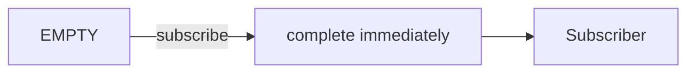

# Session 4 — Mermaid Diagrams

## ajax
```mermaid
flowchart LR
  A[ajax(url)] -- "HTTP GET" --> B[Observable<AjaxResponse>]
  B -- "next response" --> C[Subscriber]
  B -- "error" --> D[Subscriber]
```

## throwError
```mermaid
flowchart LR
  A[throwError(error)] -- "subscribe" --> B["error notification"]
  B --> C[Subscriber]
```

## EMPTY

