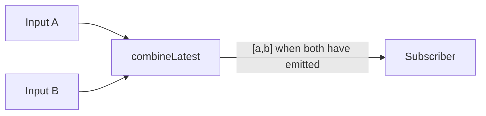
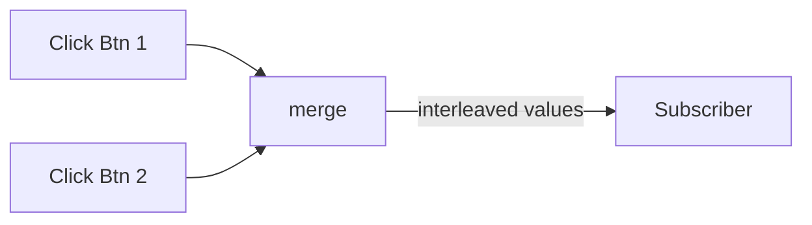
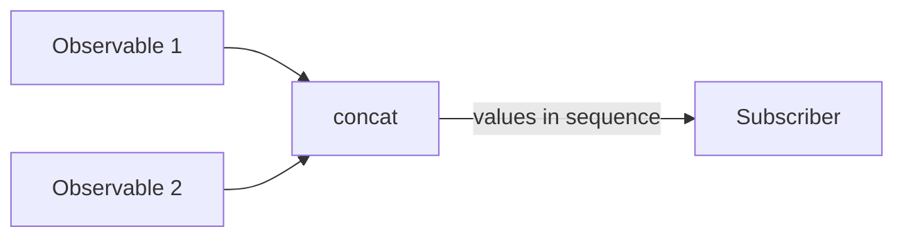

# Session 5 — Mermaid Diagrams

## combineLatest

```mermaid
flowchart LR
  A1[Input A] --> B[combineLatest]
  A2[Input B] --> B
  B -- "[a,b] when both have emitted" --> C[Subscriber]
```

## merge

```mermaid
flowchart LR
  A1[Click Btn 1] --> B[merge]
  A2[Click Btn 2] --> B
  B -- "interleaved values" --> C[Subscriber]
```

## concat

```mermaid
flowchart LR
  A1[Observable 1] --> B[concat]
  A2[Observable 2] --> B
  B -- "values in sequence" --> C[Subscriber]
```
