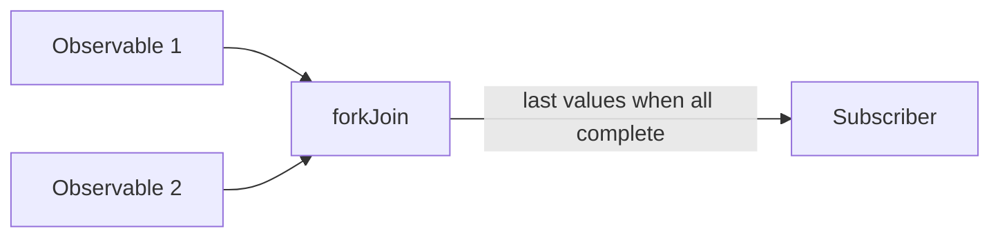
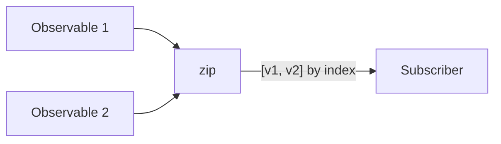
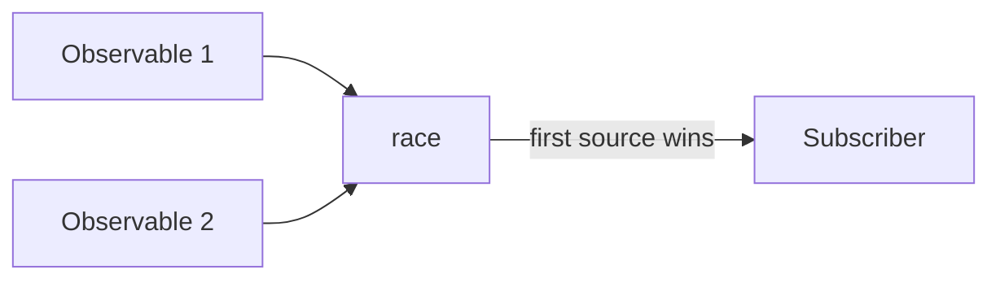

# Session 6 — Mermaid Diagrams

## forkJoin


## zip


## race


## partition
```mermaid
flowchart LR
  A[source$] --> B[partition(predicate)]
  B -- "true" --> C[Observable<T>]
  B -- "false" --> D[Observable<T>]
```
