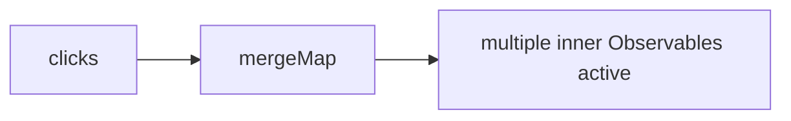
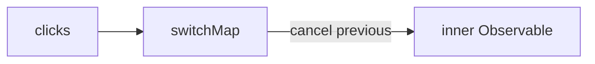
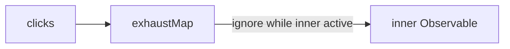

# Session 8 — Mermaid Diagrams

## map & mapTo
```mermaid
flowchart LR
  A[input values] --> B[map(x => transform)]
  B --> C[transformed values]
  A --> D[mapTo(constant)] --> E[constant values]
```

## mergeMap


## switchMap


## concatMap


## exhaustMap

